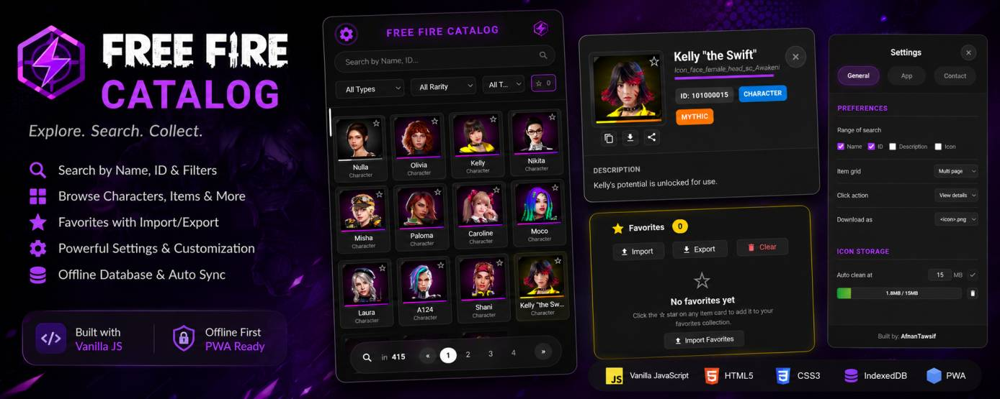

[](https://ff-catalog.netlify.app/)
&nbsp; &nbsp;[](https://github.com/AfnanTawsif/ff-catalog/blob/main/database.msgpack.gz)
## 🎮 Free Fire Catalog


**A fast, feature-rich Free Fire item catalog for searching, filtering, and browsing thousands of items with offline capability.**

🔗 **Live Website:** [https://ff-catalog.netlify.app/](https://ff-catalog.netlify.app/)

---

## 📊 Current Database Status

| **Database Version** | **Total Items** |
|----------------------|-----------------|
|     2026-07-14       |      33186      |

The app checks for a new database every 24 hours, and you can force a sync anytime using the **Sync** button from **Settings -> App**

---

## 🚀 WebApp Overview

- **🏎️ Blazing Performance**
  - Lazy-loads images & animations only when they enter the viewport.
  - Uses a **Web Worker** to parse the MessagePack database off the main thread – no UI jank.
  - Decompression (`DecompressionStream`) is hardware-accelerated in modern browsers.

- **💾 Smart Storage & Caching**
  - Icon images are cached in the browser's Cache API (to save client bandwidth upon revisit) and **automatically cleaned** when the storage limit (configurable) is exceeded.
  - The entire app (HTML, JS, CSS, SW) is cached by the Service Worker, enabling **offline access** (except new updates sync).
  - Database is stored in IndexedDB for fast subsequent loads.

- **📡 Bandwidth & Server-Cost Friendly**
  - All static assets (icons, database) are served via **jsDelivr CDN**, leveraging global edge caching.
  - The app itself is hosted on Netlify, but because almost everything runs on the client, your Netlify credits are barely consumed.
  - Service Worker updates pull new versions only when `sw.js` changes – no unnecessary network requests.

- **🎨 Beautiful & Responsive UI**
  - Glass-morphism design with animated gradients.
  - Fully responsive – works on phones, tablets, and desktops.
  - Dark theme by default to reduce eye strain.

- **⭐ Favorites System**
  - Star any item to add it to your personal favorites list.
  - Import/export favorites as JSON – share your collection.
  - Toggle **Favorites only** view to focus on your curated list.

- **🔍 Advanced Search & Filters**
  - Search by name, ID, description, or icon filename.
  - Filter by type, rarity, and in-game version tag (OBXX).
  - Choose between multi-page pagination or infinite scroll.

- **⚙️ Rich Settings**
  - Customize search scope, click action, download naming, icon storage limit, and more.
  - View database statistics, missing filters, and missing icons.
  - One-click update check and version changelog.

- **📱 PWA & Shareable**
  - Installable as a Progressive Web App on mobile devices.
  - Each item has a unique URL (`?item=ID`) – share any item directly.

- **🛠️ Developer Friendly**
  - Exposed API for fetching item icons (see below).
  - Source code is clean, well-commented, and easy to fork.
  - All configuration is centralized in `script.js` – no need to hunt through the code.

---

## 🖼️ Icon API – Use in Your Own Projects

You can directly embed any Free Fire item icon using the following URL pattern:

```text
https://cdn.jsdelivr.net/gh/AfnanTawsif/ff-catalog@main/PNG/{itemID}.png
```

Replace `{itemID}` with the numeric item ID (e.g., `907092607`).

**Example:**


`https://cdn.jsdelivr.net/gh/AfnanTawsif/ff-catalog@main/PNG/907092607.png`

All images are served with optimal caching headers via jsDelivr.

---

## 📦 Database & PNG Source

The database and icons are maintained separately from the WebApp code.

- **Database**:
  [`https://cdn.jsdelivr.net/gh/AfnanTawsif/ff-catalog@main/database.msgpack.gz`](https://cdn.jsdelivr.net/gh/AfnanTawsif/ff-catalog@main/database.msgpack.gz)
  - Original source: [Link](https://ff-item.netlify.app/data.msgpack.gz)

- **PNG Icons:**
  [`https://github.com/AfnanTawsif/ff-catalog/tree/main/PNG`](https://github.com/AfnanTawsif/ff-catalog/tree/main/PNG)
  - Original source: [Link](https://github.com/ShahGCreator/icon)

The database and icons are **updated regularly** – either when new items are added in the source repository or when I manually curate missing assets.

---

## 🛠️ Development – Customize Your Own Version

Want to run your own instance or contribute? Here’s everything you need:

### 1. Fork the Repository

Start by forking [https://github.com/AfnanTawsif/ff-catalog](https://github.com/AfnanTawsif/ff-catalog) and cloning it locally.

### 2. Project Structure

```text
ff-catalog/
├── WebApp/
│   ├── App/                         # Web application files
│   │   ├── index.html
│   │   ├── script.js
│   │   ├── sw.js
│   │   ├── db-worker.js
│   │   ├── manifest.json
│   │   ├── robots.txt
│   │   ├── sitemap.xml
│   │   └── icons/                   # App icons (SVG, PNG)
│   └── Online/                      # Dynamic files loaded via CDN
│       ├── whats_new.json           # Changelog for WebApp
│       └── author.jpg               # Author avatar
├── PNG/                             # All item icons (PNG, named by item ID)
├── database.msgpack.gz               # Compressed database
├── README.md                         # This file
└── LICENSE                           # MIT License
```

### 3. Configuration – `script.js`

All external URLs and author info are centralized in the `CONFIG` object at the top of `script.js`:

```js
const CONFIG = {
    WEBSITE_URL: '',                       // Your live site URL
    CDN_BASE_URL: '.../PNG/',              // Base for item icons
    DATABASE_URL: '.../database.msgpack.gz',
    FALLBACK_IMAGE_URL: 'icons/error.svg',
    GITHUB_REPO_URL: '...',                // Your repo URL
    GITHUB_API_TREE_URL: '.../git/trees/main?recursive=1',
    WHATS_NEW_URL: '.../whats_new.json',
    AUTHOR_IMAGE_URL: '.../author.jpg',
    CONTACT: { ... }
};
```

Update these to point to your own fork and CDN endpoints.

### 4. Updating Icons

Place new item icon PNGs in the `PNG/` folder, named with the item ID (e.g., `123456789.png`).

If you need to generate app icons for the WebApp (PWA), use [maskable.app](https://maskable.app/) to create `icon-192.png`, `icon-512.png`, etc., and place them in `WebApp/App/icons/`.

### 5. Updating the Database

The database is in MessagePack format (`.msgpack`) for max speed, then gzipped (`.gz`) for faster downloads.

To update: edit the JSON source (you can generate a json version of the database from `settings > app` inside the webapp), add new entries, modify updated_on value, convert the final json to `.msgpack` using tools like [conventro.com](https://conventro.com/convert/json-to-msgpack), then compress with maximum GZIP.

**Important:** After updating `database.msgpack.gz`, purge the jsDelivr cache to make sure users get the latest update immediately.  To purge your cdn link, visit: 

 [jsDelivr purging tool](https://www.jsdelivr.com/tools/purge)

### 6. Updating WebApp Version / Changelog

Bump the version in `sw.js`:

```js
const CACHE_NAME = 'ff-catalog-app-vX.Y.Z';
```

This triggers the Service Worker update and notifies users. Otherwise users will be stuck at old cached version of the WebApp.

Update `WebApp/Online/whats_new.json` with the new version and changes.

Then purge the jsDelivr cache for `whats_new.json`.

### 7. Updating Author Image (optional)

Replace `WebApp/Online/author.jpg` with your own picture.

Purge the CDN cache after updating. Note that author image is cached for 24 hours (just like database) to save bandwidth.

### 8. Deploy

Commit and push to your repository.

If using Netlify, connect your repo and set the publish directory to `WebApp/App`.

The app will be live at your Netlify URL.

### 9. Auto-Update Behavior

The WebApp checks for a new Service Worker version on every page reload. If a new `sw.js` is detected, it updates in the background and shows the changelog.

The database is re-fetched every 24 hours (or forced via the **Sync** button) to ensure you always have the latest items.

---

## 🤝 Contributing

Here’s how you can help:

- **Add missing icons** – If you notice an item without an icon in the app, find the PNG (or create it) and submit a pull request to the `PNG/` folder.
- **Update the database** – If you have a more complete or corrected dataset, convert it to MessagePack and submit a PR.
- **Improve the WebApp** – Bug fixes, performance enhancements, or new features are appreciated.
- **Report issues** – Open an issue on GitHub with clear steps to reproduce.

### Guidelines

- Follow the existing code style.
- Test your changes locally before submitting.
- For icon additions, ensure the file name matches the item ID exactly.

---

## 🙏 Credits

- **Database & icons:** ShahGCreator
- **Built with:** ❤️ and lots of caffeine.


If you find this useful, don’t forget to ⭐ star the repository.
